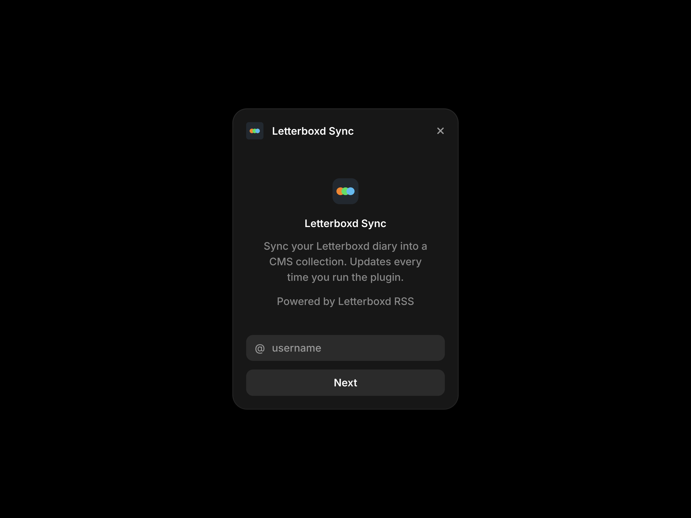

# Letterboxd Sync

A Framer CMS plugin that syncs a public Letterboxd film diary into a plugin-managed CMS collection.



The plugin uses the public RSS feed at `https://letterboxd.com/{username}/rss/`. It does not use OAuth, API keys, scraping, analytics, or any storage outside the managed CMS collection and its collection-scoped plugin data.

## Install

```bash
npm install
npm run dev
```

Then open Framer, add/open this development plugin, and configure it from the CMS managed collection flow. Use a collection named `Films` for the intended setup.

In development, RSS requests go through the existing Vite dev server at `/letterboxd-rss/...`. This avoids Letterboxd's browser CORS block while you run the plugin locally.

For published builds, Letterboxd blocks browser requests from Framer's plugin origin. This repo includes a tiny CORS proxy for production at `api/rss/[username].ts`. It only supports `GET /rss/:username`, forwards that request to Letterboxd RSS, and does not store data, authenticate users, or call any analytics service.

## Production CORS Proxy

Deploy the included proxy to a personal Vercel project, then build the plugin with that proxy URL:

```bash
npx vercel logout
npx vercel login
npx vercel --prod
VITE_LETTERBOXD_PROXY_URL=https://your-letterboxd-sync-proxy.vercel.app npm run pack
```

`npm run pack` creates `plugin.zip` for Framer submission. The plugin reads `VITE_LETTERBOXD_PROXY_URL` at build time, so repack after changing the proxy URL.

`framer.json` allows Vercel deployment URLs with `https://*.vercel.app/*`. For Marketplace submission, you can narrow this to your exact deployed proxy origin before packing.

## Use

1. Open the plugin in `configureManagedCollection` mode.
2. Enter a Letterboxd username, `@username`, or a `letterboxd.com/username` URL.
3. Click `Next`.
4. Confirm the slug format and CMS field names.
5. Click `Import from Letterboxd`.
6. The plugin validates the RSS feed, configures the CMS fields, stores the username and field settings on the managed collection, and upserts the latest diary entries.
7. Future runs in `syncManagedCollection` mode read the stored settings and sync in the background.

The plugin closes automatically after a successful import and shows a toast with the synced item count.

## Synced Fields

The plugin configures these stable field IDs:

| Field ID            | Name           | Type          |
| ------------------- | -------------- | ------------- |
| `title`             | Title          | string        |
| `year`              | Year           | number        |
| `rating`            | Rating         | number        |
| `review`            | Review         | formattedText |
| `watched_date`      | Watched        | date          |
| `is_rewatch`        | Rewatch        | boolean       |
| `contains_spoilers` | Spoilers       | boolean       |
| `poster`            | Poster         | image         |
| `letterboxd_url`    | Letterboxd URL | link          |
| `tmdb_id`           | TMDB ID        | string        |

Unrated entries omit `rating`. Entries without `tmdb:movieId` omit `tmdb_id`. List items are skipped because they do not include `letterboxd:watchedDate`.

The configure screen lets you rename fields and disable optional fields. Field types are fixed by the Letterboxd schema, matching the CMS starter mapping pattern. The field IDs stay stable so repeat syncs update the same CMS fields.

## Slugs

The configure screen supports these slug formats:

- `Title`
- `Title + Year`
- `Title + Watched Date`
- `Letterboxd ID`

New collections default to `Title + Watched Date`. Slugs are kebab-cased and deduplicated within each RSS batch. `Title + Watched Date` and `Letterboxd ID` are the safest choices for users who rewatch the same film multiple times.

## Mirror Behavior

Letterboxd RSS only exposes the most recent diary entries, usually around 50. This plugin never deletes CMS items that disappear from the RSS feed. Running it repeatedly creates a persistent, growing mirror:

- First sync imports the entries currently visible in RSS.
- Later syncs upsert by RSS `<guid>`, so existing items update instead of duplicating.
- New diary entries are added.
- Older CMS items are preserved even after they fall out of the RSS window.

The plugin cannot backfill entries that were already outside the RSS window before the first sync, or entries that enter and leave the RSS window between long gaps without syncing.

## RSS Parsing

The parser keeps XML namespace prefixes such as `letterboxd:` and `tmdb:`. Review HTML is taken from the RSS `description`, with the poster image paragraph and `Watched on...` paragraph removed before writing `review` as formatted HTML.

Poster URLs are passed directly to Framer image fields. The plugin does not download poster images.

## Errors

The UI shows friendly errors for:

- Missing or unknown usernames
- Private or unreadable diaries
- Profiles with no diary entries
- Network failures
- Malformed XML

Letterboxd does not currently send CORS headers for plugin iframe origins. [Framer's CORS docs](https://www.framer.com/developers/plugins-cors) state that plugin requests run in the browser and the remote API must explicitly allow the plugin origin. For local development, this project uses the Vite dev server proxy configured in `vite.config.ts`.

A published Framer Marketplace plugin uses the included CORS proxy. If `VITE_LETTERBOXD_PROXY_URL` is missing from a production build, the plugin shows a setup error instead of attempting a browser request that Letterboxd will block.

## Attribution

This plugin is powered by Letterboxd RSS and links to `letterboxd.com` in the UI. If you display synced reviews, ratings, posters, or Letterboxd links on a published site, keep appropriate Letterboxd attribution visible in your design.

## Scripts

```bash
npm run dev
npm run check
npm run build
npm run pack
```
